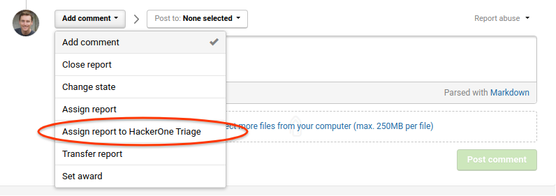
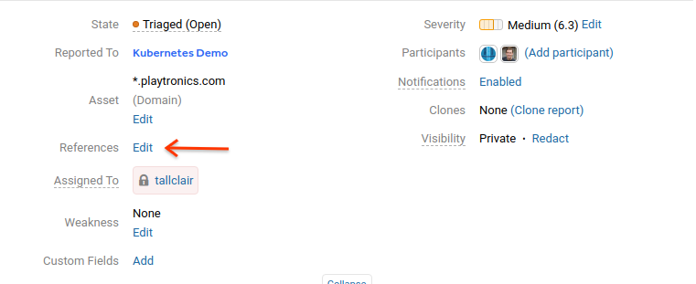
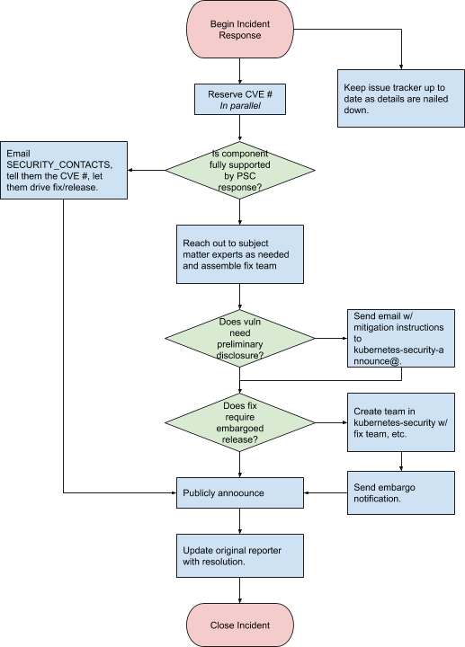

# Product Security Committee Oncall

PSC Oncall is a business-hours only oncall. That means you are not expected to
respond to issues outside of your normal daily working hours or on weekends or
holidays. If you are taking vacation or will be unable to perform your oncall
duties, please swap oncalls or find coverage for that week. See [managing oncall
rotation](#appendix-managing-oncall-rotation).

## Responsibilities

- Triage HackerOne reports daily. See [HackerOne
  Workflow](#hackerone-triage-details).
- Triage and respond to security@kubernetes.io emails daily.
- Handle incident response for ongoing issues. See [incident
  response](#incident-response-workflow).

## Triage Workflow

### HackerOne triage details

**1. Assess assigned issues**

The recommended way of reviewing hackerone issues needing triage is to check
over the assigned issues daily:
https://hackerone.com/bugs?subject=kubernetes&view=k8s\_triage

This view tracks issues that are assigned to the Kubernetes Team (PSC), but
don't yet have a bounty awarded, which is a heuristic for whether the report
needs attention.

**1.a Needs more information or Invalid**

If the report needs more information or is invalid, you can either respond
directly to the reporter (Add comment > All participants), or respond in a
private comment (Team only) and ask (reassign) the H1 Triage team to relay the
message.

**2. Set severity & tier**

Once you've determined that the report is valid and have an understanding of the
impact, set the [severity][] of the issue based on the CVSS score, and set the
tier (custom field) based on the [Kubernetes definition of
tiers](https://hackerone.com/kubernetes) (under "Rewards").

_TODO: Refine the definition of reward tiers._

[severity]: security-release-process.md#severity-thresholds---how-we-do-vulnerability-scoring

**3. File tracking issue**

Every non-public issue that we decide to take action on should get filed as a
GitHub issue in the https://github.com/kubernetes-security/security-disclosures
repo.

From the HackerOne report, you can use the [security-disclosures
bookmarklet][bookmarklet] to copy the relevant information into an issue on
https://github.com/kubernetes-security/security-disclosures/issues. Alternatively,
or when filing from an email report, you can use the [new issue template][], and
fill in the details manually.

Fill in the known details of the template, including:

- Assignee: yourself, or another PSC member who has volunteered to handle this
  issue
- Severity: according to the assigned severity score
- CVE: most code vulnerabilities (not infrastructure vulnerabilities) should
  have an assigned CVE.
- Original report: link back to the HackerOne report or google groups thread.
- Current status: one of
    - planning - preliminary response stages
    - development - fix in progress
    - embargo - fix complete, sent to distributors under embargo
    - released - fix has shipped
    - published - vulnerability details have been made public
- Attribution: the original reporter

Once the issue has been created, add the tracking issue as a reference ID on
HackerOne.

[bookmarklet]: https://github.com/kubernetes-security/security-disclosures#hackerone-issue-escalation
[new issue template]: https://github.com/kubernetes-security/security-disclosures/issues/new?template=vulnerability.md

**4. Award bounty**

Once you're confident that we've sufficiently assessed the severity and tier
(try to get an approval from someone else on the committee), it's time to award
the bounty. Note that you _do not_ need to wait until the issue is resolved
before awarding the bounty.

Choose the corresponding amount from the tiered bounty tables on
https://hackerone.com/kubernetes (under "rewards"). Then, scroll down to the
comment box on the report and change the action to "Set award". Enter the
amount, leave a comment if you'd like, and click "Set award". Congratulations,
you've completed triage on this report (continue on to incident response).

## Incident Response Workflow

## Handoff

When your shift ends, you may be the incident commander on one or more ongoing
incidents. If you are already invested in the incident and have the bandwidth
for it, you can continue managing the incident (thanks!), but _you are not
obligated to continue managing the incident!_

If you would like to handoff incident command:

1.  Start by **ensuring the tracking issue is up to date** - review the
    information in the issue description, and fill in or correct any missing
    details.
2.  **Leave a comment** to dump any additional context and state you have on the
    issue. Make sure to list any open questions or decisions and any pending
    action items.
3.  Reassign the issue to the next oncall.

Finally, reach out to the next oncall (email, slack, VC, your choice) to make
sure they're aware of the handoff and to answer any questions. _Until they've
explicitly acknowledged the handoff you are still the incident commander!_

## Appendix: Managing Oncall Rotation

### Adding the rotation to your calendar

1. Navigate to the PSC oncall rotation:
   https://kubernetes.app.opsgenie.com/settings/schedule/detail/f835cdef-8df9-4ddc-9a39-911cb9e521b5

2. Click "Open calendar" (appears on hover), add to your calendar.

### Swapping shifts or adding coverage

0. Find someone to agree to swap shifts or cover for days you will be
   unavailable.

1. Navigate to the PSC oncall rotation:
   https://kubernetes.app.opsgenie.com/settings/schedule/detail/f835cdef-8df9-4ddc-9a39-911cb9e521b5

2. Click "Add override", fill in the appropriate details.
    - Select the user who will be taking the shift
    - Select the PSC rotation
    - Enter the dates for the override

_Note: If you're swapping shifts, you'll need to do this twice, once for your
shift and once for the shift you're swapping for._

