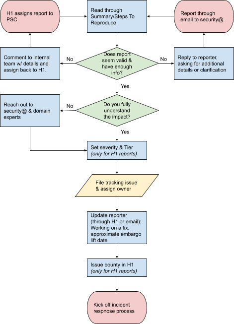

# Security Response Committee Oncall

SRC Oncall is a business-hours only oncall. That means you are not expected to
respond to issues outside of your normal daily working hours or on weekends or
holidays. If you are taking vacation or will be unable to perform your oncall
duties, please swap oncalls or find coverage for that week. See [managing oncall
rotation](#appendix-managing-oncall-rotation).

<!-- toc -->
- [Responsibilities](#responsibilities)
- [Triage Workflow](#triage-workflow)
  - [HackerOne triage details](#hackerone-triage-details)
  - [security@kubernetes.io Triage](#securitykubernetesio-triage)
- [Incident Response Workflow](#incident-response-workflow)
- [Handoff](#handoff)
- [Appendix: Managing Oncall Rotation](#appendix-managing-oncall-rotation)
  - [Adding the rotation to your calendar](#adding-the-rotation-to-your-calendar)
  - [Swapping shifts or adding coverage](#swapping-shifts-or-adding-coverage)
<!-- /toc -->

## Responsibilities

Daily:

- Triage vulnerability reports. We target 1 business day for initial response.
  - HackerOne reports ([query](https://hackerone.com/bugs?subject=kubernetes&view=k8s_triage)),see
    [HackerOne Workflow](#hackerone-triage-details) for details.
  - security@kubernetes.io emails, see [securit@kubernetes.io Triage](#securitykubernetesio-triage)
    for details.

- Handle incident response for ongoing issues
  - Drive progress on assigned issues ([query](https://github.com/kubernetes-security/security-disclosures/issues/assigned/@me))
    - See [incident response](#incident-response-workflow) for details
  - Ping incident commander of critical issues
    ([query](https://github.com/kubernetes-security/security-disclosures/issues?q=is%3Aissue+is%3Aopen+sort%3Aupdated-asc+label%3Aseverity%2Fcritical))
    if last update > 2 days ago

Weekly (ideally at the beginning of your shift):

- Ping incident commander of high severity issues
  ([query](https://github.com/kubernetes-security/security-disclosures/issues?q=is%3Aissue+is%3Aopen+sort%3Aupdated-asc+label%3Aseverity%2Fhigh))
  if last update was > 7 days ago

- Ping incident commander of medium severity issues
  ([query](https://github.com/kubernetes-security/security-disclosures/issues?q=is%3Aissue+is%3Aopen+sort%3Aupdated-asc+label%3Aseverity%2Fmedium))
  if last update was > 1 month ago

- Check for new issues in this repository, especially distributor list join requests. Triage, assign or handle new issues, as appropriate.
  ([query](https://github.com/kubernetes/security/issues))

- Check for new PRs in this repository and address open PRs where possible
  ([query](https://github.com/kubernetes/security/pulls))

## Triage Workflow

### HackerOne triage details

**1. Assess assigned issues**

The recommended way of reviewing hackerone issues needing triage is to check
over the assigned issues daily:
https://hackerone.com/bugs?subject=kubernetes&view=k8s\_triage

This view tracks issues that are assigned to the Kubernetes Team (SRC), but
don't yet have a bounty awarded, which is a heuristic for whether the report
needs attention.

**1.a. Needs more information or Invalid**

If the report needs more information or is invalid, you can either respond
directly to the reporter (Add comment > All participants), or respond in a
private comment (Team only) and ask (reassign) the H1 Triage team to relay the
message.

**2. Set severity & tier**

Once you've determined that the report is valid and have an understanding of the
impact, set the [severity][] of the issue based on the CVSS score, and set the
tier (custom field) based on the [Kubernetes definition of
tiers](https://hackerone.com/kubernetes) (under "Rewards").

_TODO: Refine the definition of reward tiers._

[severity]: security-release-process.md#severity-thresholds---how-we-do-vulnerability-scoring

**3. File tracking issue**

Every non-public issue that we decide to take action on should get filed as a
GitHub issue in the https://github.com/kubernetes-security/security-disclosures
repo.

From the HackerOne report, you can use the GitHub integration to auto-file the tracking issue, and
sync updates with the H1 report:

1. Click "References" (in the right sidebar)
2. Select "Kubernetes HackerOne Robot" to automatically create the issue.
    - If the issue was already created manually, or is being created in a different repo (e.g. for a
      public issue), select "Manual Integration" instead.
3. Click "Create"
4. Assign the created issue to the appropriate assignee (usually yourself), and apply any relevant
   labels.

**4. Award bounty**

Once you're confident that we've sufficiently assessed the severity and tier
(try to get an approval from someone else on the committee), it's time to award
the bounty. Note that you _do not_ need to wait until the issue is resolved
before awarding the bounty.

Choose the corresponding amount from the tiered bounty tables on
https://hackerone.com/kubernetes (under "rewards"). Then, scroll down to the
comment box on the report and change the action to "Set award". Enter the
amount, leave a comment if you'd like, and click "Set award". Congratulations,
you've completed triage on this report (continue on to incident response).

**5. Mark resolved & Disclose**

**Pending Resolution tab:** Once the issue has been resolved or fully handed off to the public
Kubernetes community, it should be marked as resolved. Select "Close report" from the action
drop-down over the comment box, and set the status to "Resolved". Add a comment about the final
resolution (often a link to the public announcement).

**Needs Disclosure tab:** Most issues should be publicly disclosed, unless there is a specific
reason not to. From the drop-down, choose "Request disclosure". "Full Disclosure" should be used in
most cases. It discloses all the details from the report, except for team-only comments (red comment
boxes). Specific details can be redacted.

Unfortunately there is no way to mark a report as "do not disclose". If the report shouldn't be
disclosed for any reason, leave a team-only comment with `DO NOT DISCLOSE` and a justification.

**Pending Disclosure tab:** Once disclosure has been requested, we give the original reporter 1
month to respond to the disclosure request. If there hasn't been a repsonse for over 1 month, you
can just disclose it. Select "Disclose" from the drop-down menu, and confirm the disclosure type.

### security@kubernetes.io Triage

We leverage Google Groups [collaborative
inbox](https://support.google.com/a/users/answer/167430?hl=en) features to triage incoming emails to
the list.

1. Every actionable email should have an assignee who is accountable for ensuring the report is
   followed up and responded to in a timely manner.
    - Note: we have an auto-responder which encourages reporters to resubmit reports through the
      HackerOne bug bounty, so keep an eye out for duplicates.
2. Unacctionable emails should be marked as such.
3. Issues which have been resolved should be marked as completed.
4. Legitimate vulnerability reports should be copied into a tracking issue
    - Include a link back to Google Groups thread (original report field in the template)
    - Add the `Tracked` label to the groups thread

Spam: when a spam message is received, please use the "Report abuse" button. Reporting a message as
abuse only hides it for the reporter, so after reporting it please delete the original.

## Incident Response Workflow

## Handoff

When your shift ends, you may be the incident commander on one or more ongoing
incidents. If you are already invested in the incident and have the bandwidth
for it, you can continue managing the incident (thanks!), but _you are not
obligated to continue managing the incident!_

If you would like to handoff incident command:

1.  Start by **ensuring the tracking issue is up to date** - review the
    information in the issue description, and fill in or correct any missing
    details.
2.  **Leave a comment** to dump any additional context and state you have on the
    issue. Make sure to list any open questions or decisions and any pending
    action items.
3.  Reassign the issue to the next oncall.

Finally, reach out to the next oncall (email, slack, VC, your choice) to make
sure they're aware of the handoff and to answer any questions. _Until they've
explicitly acknowledged the handoff you are still the incident commander!_

## Appendix: Managing Oncall Rotation

### Adding the rotation to your calendar

1. Navigate to the SRC oncall rotation:
   https://kubernetes.app.opsgenie.com/settings/schedule/detail/f835cdef-8df9-4ddc-9a39-911cb9e521b5

2. Click "Open calendar" (appears on hover), add to your calendar.

### Swapping shifts or adding coverage

0. Find someone to agree to swap shifts or cover for days you will be
   unavailable.

1. Navigate to the SRC oncall rotation:
   https://kubernetes.app.opsgenie.com/settings/schedule/detail/f835cdef-8df9-4ddc-9a39-911cb9e521b5

2. Click "Add override", fill in the appropriate details.
    - Select the user who will be taking the shift
    - Select the SRC rotation
    - Enter the dates for the override

_Note: If you're swapping shifts, you'll need to do this twice, once for your
shift and once for the shift you're swapping for._

